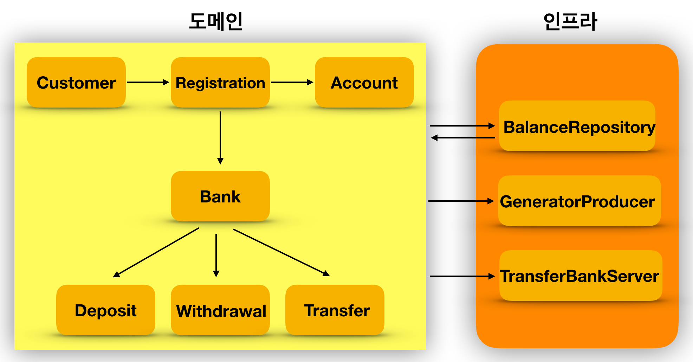
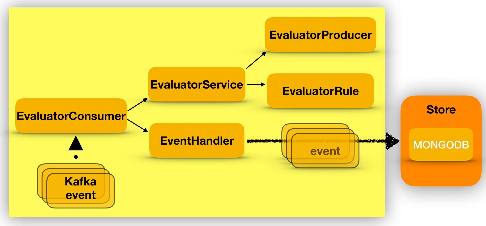

KAKAOBANK
===================

프로젝트 설명
-------------------

**transaction-generator**

1. 사용자는 회원가입, 계좌 계설 후 입금, 출금, 이체 를 진행하다.
2. 데이터는 원이 이벤트 객체를 활용하여 json 형식으로 가공 하도록 한다.
    1. 원시이벤트 는 번호, 사용자액션타입, 데이터, 날짜로 구성 된다.
3. 이체는 외부 시스템을 사용 했다고 가정한다.
4. 사용자 금액은 데이터 영속 화 없이 메모리를 사용한다.
5. 토픽 발행은 금융 특성상 발행 순서를 순차적으로 처리 하도록 했으며, 카프카 트렌젝션을 활용 하였다
    1. 카프카 브로커는 3대로 구성하고 복제는 3이며 순차 처리를 위해 1개의 파티션을 활용한다.
    2. 2대의 브로커가 응답해야 성공
    3. 네트워크 불안정으로 인한 실패는 계속 재시도 하도록 한다.
    4. 재시도  시 순서 변경을 방지 하기 위해 순차 시도 하도록 한다.

**evaluator**

1. 사용자 데이터를 이벤트 별로 데이터 가공 한다.
2. 토픽은 마지막 데이터 기준으로 가져온다.
3. 트렌젝션 발생 후  성공한 데이터만 가져오도록 한다.
4. 이상 데이터 감지는 이체와, 출금 발생시에만 트리거 된다.
5. 사용자 모든 이벤트는 몽고 db에 영속화 한다.
6. 만약 이벤트 데이터 처리중 실패가 발생하면 카프카 이벤트를 별도 몽고 디비에 저장하여 외부 시스템에서 반응 할수 있다고 가정한다.
7. 토픽 커밋은 비동기로 처리하며, 네트워크 장애에 재시도시 단조 커밋을 위해 이전 토픽과 비교 하여 커밋 하도록 처리 한다.
8. 사용자 룰은 4가지 타입으로
    1. 몇세 이상 인지, 몇시간 내에 계좌를 생성했는지, 마지막 입금후 몇시간 내에 이체및 출금인지, 이상감지할 잔액 기준은 무엇인지를 설정 하도록 한다.
    2. 사용자룰은 한가지만 등록 하도록 우선 처리 하였다.
9. 사용자 룰에 적합한 이상 감지 데이터는 별도 토픽으로 발행 하도록 한다.

주요 고려 사항
-------------------
**Producer**
1. 메시지는 순차적으로 발행 되어야 하며 정확하게 한번 발송되어야 한다.
2. 네트워크 에러 시에 재시도 되어야 한다.
3. 사용자 객체는 요구 사항을 받아 들어야한다.
4. 고객 계좌 금액은 메모리에 저장으로 가정한다.

**Consumer**
1. 정확하게 발송된 메시지만 수신 하도록 한다.
2. 이체와 출금 이벤트 발생 시에는 이상 감지를 호출 한다.
3. 등록한 룰을 기준으로 이상감지를 검사하고 논블럭하게 진행 한다.
4. 이상 감지 조건에 만족 한다면 해당 메시지를 카프카 에 발송 한다.
5. 이상 감지 실행시 예외 가 발생 한다면 실패한 토픽은 몽고DB에 저장한다.(외부 시스템에서 바로 반응 할수 있다고 가정한다.)
6. 사용자 이벤트  메시지는 모두 몽고 DB에 저장 해야한다.
7. 컨슈머 비동기 커밋 재 시도시 단조 증가를 활용해 최신 커밋 이전 토픽이 커밋되지 않도록 한다.

MongoDB
-------------------

몽고는 도커로 환경을 구축 하였다
https://hub.docker.com/_/mongo

1. 데이터베이스 생성
    - use bank-customer-events

2. 테이블 생성
    - db.createCollection("account")	
    - db.createCollection("deposit")
    - db.createCollection("registration")
    - db.createCollection("transfer")
    - db.createCollection("withdrawal")
    - db.createCollection("record")
3. 인덱스 생성    
    db.account.createIndex( { "customerId._id" : 1 } )
    db.deposit.createIndex( { "customerId._id": 1 } )
    db.registration.createIndex( { "customerId._id": 1 } )
    db.transfer.createIndex( { "customerId._id": 1 } )
    db.withdrawal.createIndex( { "customerId._id": 1 } )
    db.record.createIndex( { "topic": 1, "partition": 1 } )
    db.record.createIndex( { "topic": 1, "offset": 1 } )
    
KAFKA
-------------------
카프카 는 사내 클라우드 장비로 테스트 하였다.

1. 브로커 옵션
    - min.insync.replicas=2
2. 토픽 생성    
    - ./kafka-topics.sh --create --zookeeper {localhost:2181 ... 3대} --replication-factor 3 --partitions 1 --topic fds.transactions
    - ./kafka-topics.sh --create --zookeeper {localhost:2181 ... 3대} --replication-factor 3 --partitions 3 --topic fds.detections
3. 로깅     
    - ./kafka-console-consumer.sh --topic fds.transactions --bootstrap-server {localhost:9092 ...} --from-beginning

실행 결과
-------------------
1. evaluator 서버 시작 (consumer)
2. transaction-generator -> Application.java -> Scenario.fail1(bankProducer, repository); (메인 함수 실행)

3. **transaction-generator** 로그 출력
[main] INFO com.kakaobank.Application - date : 2020-07-02T22:27:16.449, 실패 시나리오 start.....
[main] INFO com.kakaobank.Scenario - 아이디 : CustomerId{id=0a7d42e8-bf4e-46bd-b96a-326ba29d7cc9}, 황미영님 입금하였습니다. : Money{amount=500000}, 황미영님 통장 잔고 : Money{amount=500000}
[main] INFO com.kakaobank.Scenario - 아이디 : CustomerId{id=0a7d42e8-bf4e-46bd-b96a-326ba29d7cc9}, 황미영님 입금하였습니다. : Money{amount=500000}, 황미영님 통장 잔고 : Money{amount=1000000}
[main] INFO com.kakaobank.Scenario - 아이디 : CustomerId{id=0a7d42e8-bf4e-46bd-b96a-326ba29d7cc9}, 황미영님 인출하였습니다. : Money{amount=1000000}, 황미영님 통장 잔고 : Money{amount=0}
[main] INFO com.kakaobank.Application - 실패 시나리오 end.....

4. **evaluator**
이상 감지시 발행되는 토픽 확인
./kafka-console-consumer.sh --topic fds.detections  --bootstrap-server {localhost:9092 ...} --from-beginning

5. 발행된 메시지 : An unusual transaction has been detected. customer : CustomerId{id=499fac4c-f92f-4f1d-b496-dacd82bf913c}, dateTime : 2020-07-02T22:27:20.817

이체 및 인출 감지 시작 시간 -> 2020-07-02T22:48:54.305, event : Withdrawal{customerId=CustomerId{id=e799b512-a449-4ed2-a4cc-56fa4adf9ec0}, accountNumber=AccountNumber{no='3333-07-8711507'}, money=Money{won=1000000}, createDate=2020-07-02T22:48:54.104}

fds.transactions 발송 시간 -> 2020-07-02T22:48:54.104, An unusual transaction has been detected. customer : CustomerId{id=e799b512-a449-4ed2-a4cc-56fa4adf9ec0}, dateTime : 2020-07-02T22:48:54.104
